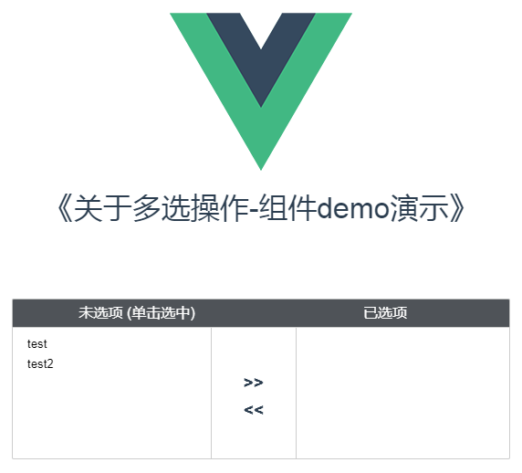

# VueMultiselect
基于Vue2.4.2 多选框组件

### demo演示介绍

- 组件内部flex布局，宽高自适应。

### 使用方法
- 在开发环境引用
```
// 引入组件
import MultiSelect from '@/extends/VueMultiselect'

// 将组件注册为公用组件
Vue.use(MultiSelect)

// 注册后可直接在单文件组件内引用
```

- 组件的参数介绍
```
<multi-select
  :editAble="false"
  v-model="returnValue"
  :candidates="{left:leftArray, right:rightArray}"
  style="height: 14rem;">
</multi-select>

editAble         // 表示选中后的条目是否可以右键编辑 类型：Boolean
                 // 编辑的功能：可以给单个条目添加字符串
leftArray []     // 表示多选框中备选的条目 不能为空
rightArray []    // 表示已经选择的条目 可以为空
returnValue      // 表示被选中条目的返回值，可以添加v-binding， 返回值结构：
[{
    name: 'item-01',
    id: '1000'
}]               // 对象数组

leftArray,rightArray 两个数组的结构为：
[{
    name: 'item-01',
    id: '1000'
}, {
    name: 'item-02',
    id: '1001'
}]               // 对象数组

如果希望多选框中的备选项目是联动的，需要给组件外部添加渲染条件
保证multi-select组件可以在获得新的数据后更新。
其实可以用 nextTick() 函数方法写在组件内的mounted()内，进行改进。

```

### 演示请参考demo (node-6.0.0以上)
